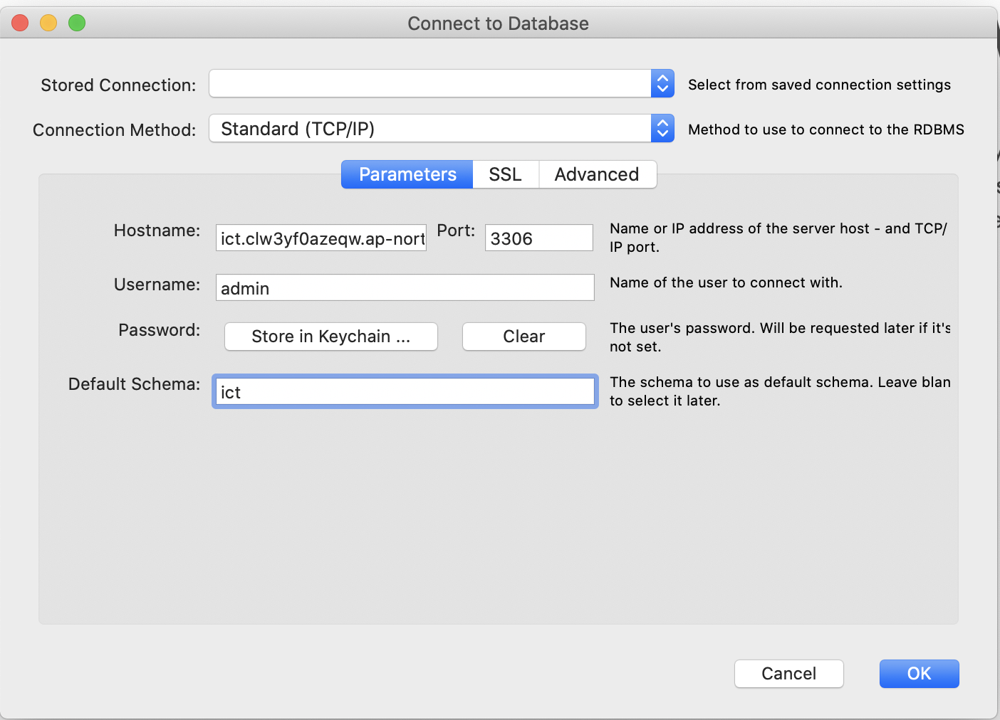
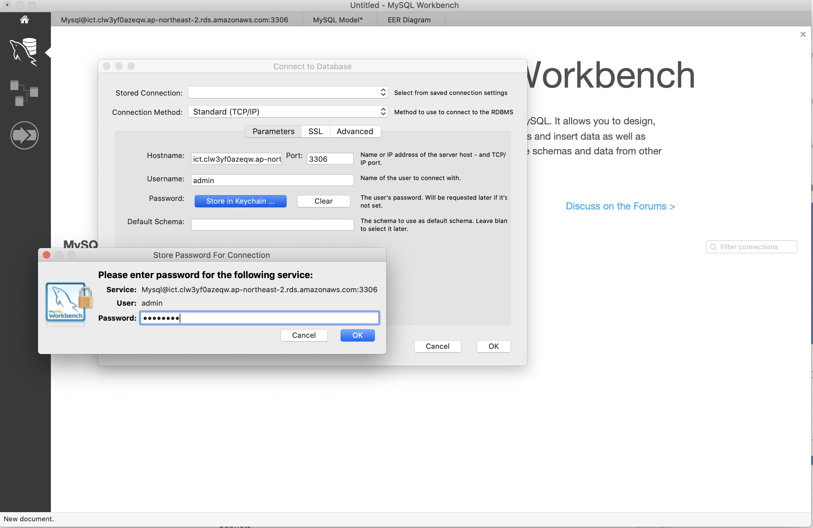

### 1. MySQL Workbench 다운로드 
다운로드 링크: https://dev.mysql.com/downloads/workbench/

### 2. Database - Connect to Database 누르기 

### 3. 필요한 것 입력 

Hostname : ict.clw3yf0azeqw.ap-northeast-2.rds.amazonaws.com

Port : 3306 

Username : admin

Password : Store in Keychain 누르고  48834883 입력 

Default Schema : ict

\* 나머지는 그대로 두기 

### 4.  ok 누르기 

### 5. 끝 ~!